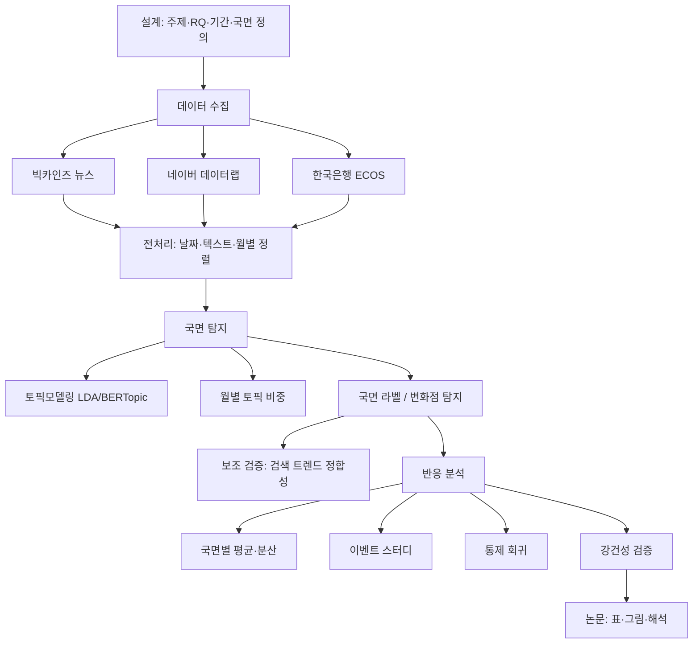

<callout icon="📌" color="blue_bg">
	**한 줄 정의**: 경제 뉴스·검색 데이터를 마이닝해 시기별 이슈 국면(물가·금리·부동산·대외 등)을 탐지하고, 국면별 코스피·환율·CCSI 반응 패턴 차이를 검증한다.
	<br>**현재 단계**: Step 2 직전 (본데이터 구축) · 파일럿 판정 **Conditional Go** (2026-08-01)
	<br>**저장소**: `DataMining` · 공통 기간 권장 **2016-01 ~ 최신 가능 월**
</callout>
<table_of_contents color="gray"/>
---
# 1. 연구 개요 {color="blue"}
## 1.1 정식 주제
뉴스·검색 데이터 기반 **한국형 경제 이슈 국면 탐지** 및 **국면별 시장·심리 지표 반응 분석**
## 1.2 연구 목적
1. 한국 경제 뉴스·검색 데이터에서 **월(또는 주) 단위 경제 이슈 국면**을 자동 탐지한다.
2. 국면 전환 시점을 식별하고, 국면별로 시장·심리 지표 반응 차이를 측정한다.
3. 감성지수(NSI/ENSI)와 구분되는 **이슈 국면 중심의 분석 체계**를 제시한다.
## 1.3 연구 의의
- 기존 뉴스 기반 연구는 “긍정/부정” 심리 온도에 집중하는 경우가 많다. 본 연구는 **“지금 어떤 이슈가 중심인가”**로 질문을 전환한다.
- 국면 라벨·토픽 비중 시계열을 통해 **시기별 이슈 구조**를 가시화할 수 있다.
- 국면별 코스피·환율·CCSI 반응 패턴을 비교하면, 단순 감성 점수만으로는 얻기 어려운 **해석 단서**를 제공한다.
- 재현 가능한 데이터마이닝 파이프라인을 구축해 후속 연구·확장(기간 연장, 국면 수 조정)이 가능하다.
<callout icon="⚠️" color="yellow_bg">
	본 연구는 주가·집값 변동의 **단일 원인 설명 지표**를 만드는 연구가 아니다. “국면이 지수를 움직였다”는 **강한 인과 단정**을 하지 않는다.
</callout>
## 1.4 기존 연구와의 차별점
<table fit-page-width="true" header-row="true">
<tr>
<td>구분</td>
<td>기존 NSI/감성지수</td>
<td>본 연구</td>
</tr>
<tr>
<td>핵심 질문</td>
<td>분위기가 긍정/부정인가?</td>
<td>지금 어떤 이슈가 중심인가?</td>
</tr>
<tr>
<td>산출물</td>
<td>감성 점수</td>
<td>국면 라벨 + 토픽 비중 시계열</td>
</tr>
<tr>
<td>해석</td>
<td>심리 온도</td>
<td>이슈 유형별 국면 식별</td>
</tr>
<tr>
<td>목표</td>
<td>심리 요약</td>
<td>국면 탐지 + 국면별 반응 차이 분석</td>
</tr>
</table>
## 1.5 연구 질문 (RQ)
- **RQ1**: 뉴스 토픽 비중으로 한국 경제 이슈 국면을 안정적으로 분류할 수 있는가?
- **RQ2**: 국면 전환 시점을 데이터 기반으로 탐지할 수 있는가?
- **RQ3**: 국면별로 코스피·환율·CCSI 등의 반응 패턴이 다른가?
- **RQ4** (선택): 검색 트렌드는 뉴스 기반 국면을 보조·검증하는가?
## 1.6 할 것 / 하지 않을 것
<columns>
	<column ratio="50">
		### ✅ 할 것
		- 국면 식별 (지금 무슨 이슈인가)
		- 국면별 지표 반응의 **연관·패턴 차이** 검증
		- 재현 가능한 데이터마이닝 파이프라인 구축
	</column>
	<column ratio="50">
		### ❌ 하지 않을 것
		- “국면이 지수를 움직였다”는 인과 단정
		- NSI를 대체하는 만능 단일 설명 지표 개발
		- 모든 자산가격 변동의 완전 설명
	</column>
</columns>
---
# 2. 현재 진행 현황 {color="blue"}
## 2.1 단계 체크리스트
- [x] Step 1. 설계·파일럿 (방법론 골격 검증 완료)
- [ ] Step 2. 본데이터 구축 (빅카인즈·ECOS·데이터랩)
- [ ] Step 3. 국면 탐지 모델 (LDA/BERTopic + 변화점 탐지)
- [ ] Step 4. 반응 분석 (평균 비교·이벤트 스터디·통제 회귀)
- [ ] Step 5. 강건성·논문화
## 2.2 파일럿 판정 요약
<table fit-page-width="true" header-row="true">
<tr>
<td>항목</td>
<td>결과</td>
</tr>
<tr>
<td>Verdict</td>
<td>**Conditional Go**</td>
</tr>
<tr>
<td>의미</td>
<td>연구 설계(RQ1–RQ3)는 타당. 본연구는 실데이터(빅카인즈·ECOS·데이터랩) 확보 후 진행</td>
</tr>
<tr>
<td>파일럿 검증</td>
<td>키워드 룰 기반 국면 파이프라인 PASS (합성·RSS 테스트)</td>
</tr>
<tr>
<td>본연구 가능 여부</td>
<td>장기 뉴스 코퍼스 확보 전까지 논문급 분석 보류</td>
</tr>
</table>
## 2.3 최근 완료 작업 (2026-08-08 기준)
- 합성/RSS 파일럿 데이터를 `data/**/_archive_pilot/`로 아카이브
- 파일럿 스크립트를 `analysis/pilot/`로 분리
- `README`, `.gitignore`, `.env.example`, `config/config.yaml` 정비
- 본연구용 raw/processed 폴더 규약 생성
- 의존성 설치: `scikit-learn`, `scipy`, `ruptures`, `matplotlib`, `seaborn` 등
- `.venv` + `.env` 환경 준비 (ECOS / 네이버 키 로드 확인)
## 2.4 바로 다음 할 일
1. 빅카인즈 CSV → `data/raw/bigkinds/` 수동 투입
2. ECOS 월별 지표 → `data/raw/ecos/` (API 또는 CSV)
3. (권장) 네이버 데이터랩 트렌드 → `data/raw/datalab/`
4. Step 3: LDA 기반 토픽·국면 탐지 본분석 코드 작성
---
# 3. 전체 아키텍처 {color="blue"}
## 3.1 파이프라인 개요

## 3.2 계층 구조
<table fit-page-width="true" header-row="true">
<tr>
<td>계층</td>
<td>역할</td>
<td>주요 경로</td>
</tr>
<tr>
<td>Config</td>
<td>기간·스키마·국면·모델 하이퍼파라미터</td>
<td>`config/config.yaml`, `.env`</td>
</tr>
<tr>
<td>Ingest</td>
<td>외부 데이터 수집/투입</td>
<td>`api/`, `crawler/`, `data/raw/*`</td>
</tr>
<tr>
<td>Process</td>
<td>정제·토픽·국면·반응 산출</td>
<td>`analysis/`, `data/processed/*`</td>
</tr>
<tr>
<td>Pilot</td>
<td>방법론 골격 검증 (본연구와 분리)</td>
<td>`analysis/pilot/`, `data/**/_archive_pilot/`</td>
</tr>
<tr>
<td>Docs</td>
<td>계획서·실현가능성 보고서</td>
<td>`docs/`</td>
</tr>
</table>
## 3.3 데이터 흐름
```text
[raw]
 bigkinds/*.csv  ──┐
 ecos/*.csv      ──┼──► 전처리·월 정렬 ──► [processed/regimes]
 datalab/*.csv   ──┘                         │
                                              ├──► 국면×지표 merge
                                              └──► [processed/reactions]
```
## 3.4 국면 라벨 (초안)
<table fit-page-width="true" header-row="true">
<tr>
<td>국면</td>
<td>예상 키워드/토픽</td>
</tr>
<tr>
<td>물가</td>
<td>물가, 인플레이션, 원자재, 공공요금</td>
</tr>
<tr>
<td>금리</td>
<td>기준금리, 대출, 이자, 긴축</td>
</tr>
<tr>
<td>부동산</td>
<td>집값, 전세, 청약, 대출규제</td>
</tr>
<tr>
<td>대외</td>
<td>환율, 연준, 수출, 지정학</td>
</tr>
<tr>
<td>성장/실적 (선택)</td>
<td>성장률, 실적, 고용, 경기</td>
</tr>
</table>
최종 국면 수는 토픽 해석 가능성에 따라 **4~6개**로 조정한다.
---
# 4. 방법론 {color="blue"}
## 4.1 국면 탐지
1. 문서(뉴스) → 토픽 분포 추정
2. 시점별 토픽 비중 벡터 생성
3. 국면 라벨
	- 기본: 최대 비중 토픽을 해당 월 국면으로 사용
	- 개선: 상위 토픽 비중 임계값, 또는 클러스터링으로 국면 정의
4. 전환: 토픽 비중 구조 변화 시점을 전환점으로 탐지 (PELT 등)
## 4.2 반응 차이 측정
1. **구간 평균 비교**: 국면별 지표 변화량의 평균/표준편차
2. **이벤트 스터디**: 전환 시점 기준 전후 ±1~3개월 누적 경로
3. **통제 회귀**: 금리·환율·글로벌 요인 통제 후 국면 계수 유의성 확인
## 4.3 해석 원칙
- 가능: “국면별로 반응 패턴이 유의하게 다르다”
- 가능: “국면 정보가 감성 점수만 볼 때보다 해석에 도움이 된다”
- 조심: “국면이 지표 변화를 유발했다” (인과 단정 금지)
---
# 5. 데이터 전략 {color="blue"}
## 5.1 데이터 소스
<table fit-page-width="true" header-row="true">
<tr>
<td>데이터</td>
<td>소스</td>
<td>역할</td>
<td>비고</td>
</tr>
<tr>
<td>경제 뉴스</td>
<td>**빅카인즈**</td>
<td>본연구 뉴스 코퍼스</td>
<td>수동 다운로드 (무단 크롤링 금지)</td>
</tr>
<tr>
<td>뉴스 (파일럿)</td>
<td>공개 RSS / 네이버 검색 API</td>
<td>파이프라인 검증</td>
<td>장기 본연구 불가</td>
</tr>
<tr>
<td>검색 트렌드</td>
<td>네이버 데이터랩</td>
<td>관심도 보조 신호 (RQ4)</td>
<td>2016-01-01~ · 구간 상대지수</td>
</tr>
<tr>
<td>경제지표</td>
<td>한국은행 ECOS</td>
<td>반응 분석 대상</td>
<td>CCSI, KOSPI, USD_KRW, BASE_RATE</td>
</tr>
</table>
## 5.2 입력 스키마
<details>
<summary>뉴스 (bigkinds)</summary>
	- 필수: `date`, `title`, `content`
	- 선택: `source`, `link`, `media`
</details>
<details>
<summary>ECOS</summary>
	- 필수: `date`, `indicator`, `value`
	- 지표: `CCSI`, `KOSPI`, `USD_KRW`, `BASE_RATE`
</details>
<details>
<summary>데이터랩</summary>
	- 필수: `date`, `keyword_group`, `score`
	- 선택: `period_start`, `period_end`
	- 주의: 조회 기간을 논문 전체 기간으로 **고정** 후 수집
</details>
## 5.3 공통 설정 요약
```yaml
project:
  name: korea_economic_issue_regime
  study_period_start: "2016-01-01"
regimes:
  labels: [물가, 금리, 부동산, 대외, 성장]
  freq: M
topic_model:
  method: lda
  n_topics: 8
  random_state: 42
analysis:
  event_window_months: 3
  min_articles_per_month: 30
```
---
# 6. 파일·폴더 구조 {color="blue"}
## 6.1 목표 디렉터리 트리
```text
DataMining/
├── analysis/                 # 본분석 스크립트 (Step 2~)
│   ├── pilot/                # Step 1 파일럿 (본연구와 분리)
│   │   ├── run_feasibility_regime.py
│   │   └── run_datamining_test.py
│   ├── preprocess/           # (예정) 뉴스·지표 정제
│   ├── topics/               # (예정) LDA/BERTopic
│   ├── regimes/              # (예정) 국면 라벨·전환 탐지
│   └── reactions/            # (예정) 반응표·이벤트스터디·회귀
├── api/                      # ECOS·데이터랩 API 클라이언트 (예정)
├── crawler/                  # 수집 유틸 (빅카인즈는 수동)
├── config/
│   └── config.yaml
├── data/
│   ├── raw/
│   │   ├── bigkinds/         # 본연구 뉴스
│   │   ├── ecos/             # ECOS 지표
│   │   ├── datalab/          # 검색 트렌드
│   │   └── _archive_pilot/   # 합성·RSS 파일럿 (실증 금지)
│   └── processed/
│       ├── regimes/          # 월별 국면 시계열
│       ├── reactions/        # 국면별 반응표
│       └── _archive_pilot/
├── docs/
│   ├── research_plan.md
│   └── feasibility_report.md
├── requirements.txt
├── .env.example
└── README.md
```
## 6.2 폴더 역할 규칙
- **본연구 실데이터**: `data/raw/{bigkinds,ecos,datalab}` 에만 적재
- **파일럿/합성**: `_archive_pilot` 만 사용. **논문 분석에 쓰지 않음**
- **산출물**: 국면 → `processed/regimes`, 반응 → `processed/reactions`
- **시크릿**: `.env` (깃 제외). 템플릿은 `.env.example`
## 6.3 권장 모듈 확장안 (Step 2 이후)
<table fit-page-width="true" header-row="true">
<tr>
<td>모듈</td>
<td>파일 예시</td>
<td>책임</td>
</tr>
<tr>
<td>API</td>
<td>`api/ecos_client.py`, `api/datalab_client.py`</td>
<td>키 로드·요청·CSV 저장</td>
</tr>
<tr>
<td>전처리</td>
<td>`analysis/preprocess/news.py`, `ecos.py`</td>
<td>스키마 통일·중복 제거·월 정렬</td>
</tr>
<tr>
<td>토픽</td>
<td>`analysis/topics/lda_fit.py`</td>
<td>벡터화·LDA·토픽 키워드 추출</td>
</tr>
<tr>
<td>국면</td>
<td>`analysis/regimes/label.py`, `changepoint.py`</td>
<td>비중·dominant 라벨·PELT</td>
</tr>
<tr>
<td>반응</td>
<td>`analysis/reactions/event_study.py`, `regression.py`</td>
<td>반응표·경로·통제 회귀</td>
</tr>
<tr>
<td>실행 진입점</td>
<td>`python -m analysis.run_main` (예정)</td>
<td>end-to-end 오케스트레이션</td>
</tr>
</table>
---
# 7. 라이브러리·환경 {color="blue"}
## 7.1 Python 스택
<table fit-page-width="true" header-row="true">
<tr>
<td>라이브러리</td>
<td>용도</td>
</tr>
<tr>
<td>`pandas`, `numpy`</td>
<td>테이블·수치 처리</td>
</tr>
<tr>
<td>`scipy`</td>
<td>통계·검정 보조</td>
</tr>
<tr>
<td>`PyYAML`, `python-dotenv`</td>
<td>설정·환경변수</td>
</tr>
<tr>
<td>`requests`</td>
<td>HTTP API 호출</td>
</tr>
<tr>
<td>`scikit-learn`</td>
<td>Count/TF-IDF, LDA, 전처리 파이프라인</td>
</tr>
<tr>
<td>`ruptures`</td>
<td>변화점 탐지 (PELT 등)</td>
</tr>
<tr>
<td>`matplotlib`, `seaborn`</td>
<td>시계열·반응 경로 시각화</td>
</tr>
<tr>
<td>`openpyxl`</td>
<td>빅카인즈 엑셀 투입</td>
</tr>
<tr>
<td>`konlpy` (선택)</td>
<td>한국어 형태소 (Java 필요)</td>
</tr>
</table>
## 7.2 환경 변수
- `ECOS_API_KEY` — 한국은행 ECOS
- `NAVER_CLIENT_ID` / `NAVER_CLIENT_SECRET` — 네이버 API·데이터랩
## 7.3 환경 세팅
```powershell
python -m venv .venv
.\.venv\Scripts\Activate.ps1
pip install -r requirements.txt
copy .env.example .env
```
---
# 8. 주요 함수·모듈 (현재 구현) {color="blue"}
## 8.1 analysis.pilot.run_feasibility_regime
합성 데이터로 국면 파이프라인 골격을 검증하는 최소 파일럿.
<table fit-page-width="true" header-row="true">
<tr>
<td>함수</td>
<td>역할</td>
</tr>
<tr>
<td>`ensure_dirs()`</td>
<td>raw/processed 아카이브 경로 생성</td>
</tr>
<tr>
<td>`load_or_build_news()`</td>
<td>뉴스 CSV 로드 (없으면 합성 생성)</td>
</tr>
<tr>
<td>`load_or_build_ecos()`</td>
<td>ECOS CSV 로드 (없으면 합성 생성)</td>
</tr>
<tr>
<td>`score_regimes(text)`</td>
<td>국면별 키워드 출현 점수</td>
</tr>
<tr>
<td>`assign_doc_regime(row)`</td>
<td>문서 단위 dominant 국면 부여</td>
</tr>
<tr>
<td>`build_monthly_regimes(news)`</td>
<td>월별 비중·regime_label·기사 수</td>
</tr>
<tr>
<td>`merge_ecos_and_reaction(...)`</td>
<td>지표 merge + 국면별 mean/std 반응표</td>
</tr>
<tr>
<td>`main()`</td>
<td>실행·로그·CSV 저장</td>
</tr>
</table>
**실행**: `python -m analysis.pilot.run_feasibility_regime`
**산출**: `feasibility_regime_monthly.csv`, `feasibility_regime_reaction.csv`
## 8.2 analysis.pilot.run_datamining_test
공개 RSS + Yahoo Finance로 실제 수집·마이닝이 되는지 확인하는 테스트본 (API 키 불필요).
<table fit-page-width="true" header-row="true">
<tr>
<td>함수</td>
<td>역할</td>
</tr>
<tr>
<td>`http_get(url)`</td>
<td>SSL·UA 포함 HTTP GET</td>
</tr>
<tr>
<td>`collect_news_rss()`</td>
<td>연합·JTBC·한경 경제 RSS 수집</td>
</tr>
<tr>
<td>`collect_yahoo_monthly(...)`</td>
<td>월별 종가 시계열 수집</td>
</tr>
<tr>
<td>`collect_indicators()`</td>
<td>KOSPI·USD_KRW 수집</td>
</tr>
<tr>
<td>`mine_article_level(news)`</td>
<td>기사별 국면·점수 부여</td>
</tr>
<tr>
<td>`mine_regimes(articles)`</td>
<td>월별 dominant 국면·비중</td>
</tr>
<tr>
<td>`merge_with_indicators(...)`</td>
<td>국면×지표 left join</td>
</tr>
<tr>
<td>`write_run_summary(...)`</td>
<td>실행 요약 메트릭 CSV</td>
</tr>
</table>
**실행**: `python -m analysis.pilot.run_datamining_test`
**결과 기준**: 뉴스·지표·국면 결과 존재 + 라벨 기사 &gt; 0 → PASS
## 8.3 파일럿 방법 vs 본연구 방법
<table fit-page-width="true" header-row="true">
<tr>
<td>구분</td>
<td>파일럿 (현재)</td>
<td>본연구 (예정)</td>
</tr>
<tr>
<td>국면 부여</td>
<td>키워드 룰 프록시</td>
<td>LDA/BERTopic → 토픽–국면 매핑</td>
</tr>
<tr>
<td>전환 탐지</td>
<td>월별 dominant 변화 관찰</td>
<td>ruptures PELT 등</td>
</tr>
<tr>
<td>뉴스</td>
<td>합성 / RSS</td>
<td>빅카인즈 장기 코퍼스</td>
</tr>
<tr>
<td>지표</td>
<td>합성 / Yahoo</td>
<td>ECOS 월별</td>
</tr>
</table>
---
# 9. 단계별 진행 계획 {color="blue"}
## Step 1. 파일럿 (완료)
- 목적: 방법론 작동 여부 확인 (최종 결과 아님)
- 산출: 월별 국면 CSV, 반응표, Conditional Go 판정
## Step 2. 본데이터 구축 (2~4주) — 현재
- 빅카인즈·데이터랩·ECOS 적재
- 공통 기간(2016~) 정렬
## Step 3. 국면 탐지 모델 (3~4주)
- LDA/BERTopic, 국면 매핑, 월별 비중, 변화점 탐지
## Step 4. 반응 분석 (2~3주)
- 국면별 평균·이벤트 스터디·통제 회귀
## Step 5. 강건성·논문화 (2~3주)
- 기간/국면 수/키워드 민감도, 감성지수 비교, 논문 초고
### 16주 일정 (예시)
<table fit-page-width="true" header-row="true">
<tr>
<td>주차</td>
<td>내용</td>
<td>산출</td>
</tr>
<tr>
<td>1–2</td>
<td>주제·선행연구·수집 계획</td>
<td>계획 확정</td>
</tr>
<tr>
<td>3–4</td>
<td>파일럿 토픽/국면 실험</td>
<td>파일럿 노트</td>
</tr>
<tr>
<td>5–7</td>
<td>본데이터 구축</td>
<td>raw/processed</td>
</tr>
<tr>
<td>8–10</td>
<td>국면 탐지 모델</td>
<td>국면 시계열</td>
</tr>
<tr>
<td>11–12</td>
<td>반응 분석·통제 회귀</td>
<td>반응표·그래프</td>
</tr>
<tr>
<td>13–14</td>
<td>강건성 검증</td>
<td>검증 결과</td>
</tr>
<tr>
<td>15–16</td>
<td>논문 초고·수정</td>
<td>논문 드래프트</td>
</tr>
</table>
---
# 10. 기대 결과·산출물 {color="blue"}
## 10.1 필수 산출물
1. **월별 국면 시계열** — YYYY-MM, regime_label, 토픽 비중
2. **국면 전환 목록** — 전환 월, 이전 → 이후 국면
3. **국면별 반응표** — 코스피·환율·CCSI 평균 변화·변동성
4. **전환 전후 반응 그림** — 이벤트 스터디 경로
5. **검증 결과** — 통제 회귀·강건성 요약
6. **해석 요약** — 최근 주요 국면과 특징
## 10.2 이 연구에서 얻을 수 있는 것
- 한국 경제 뉴스에서 추출한 **이슈 국면 지도**(시계열)
- “심리 온도”가 아닌 **이슈 유형 관점**의 해석 프레임
- 국면별로 시장·심리 지표가 **다르게 반응하는지**에 대한 실증 근거
- 감성지수 대비 **추가 정보량**이 있는지에 대한 비교 결과
- 재현 가능한 코드·데이터 규약 (후속 연구 기반)
## 10.3 성공 기준
- 국면 라벨이 실제 경제 이슈 흐름과 대체로 부합
- 국면별 지표 반응에 관측 가능한 차이 존재
- 단순 감성 점수 대비 추가 해석 정보 제공
- 데이터·코드 기준으로 결과 재현 가능
## 10.4 실패로 볼 수 있는 경우 (그래도 논문 가능)
- 토픽이 해석 불가능하게 섞임
- 국면 라벨이 과도하게 불안정
- 국면별 반응 차이가 일관되게 없음
→ 이 경우에도 **“한국 데이터에서 이슈 국면–반응 연결이 약하다”**는 결과로 정리 가능
## 10.5 논문 구성 (초안)
1. 서론 (배경·문제·목적)
2. 관련 연구 (NSI, narrative economics, news topic–macro)
3. 데이터
4. 방법론 (토픽·국면·반응)
5. 결과
6. 논의 및 한계
7. 결론
---
# 11. 한계와 대응 {color="blue"}
<table fit-page-width="true" header-row="true">
<tr>
<td>한계</td>
<td>설명</td>
<td>대응</td>
</tr>
<tr>
<td>네이버 뉴스 기간 부족</td>
<td>최근 기사 위주</td>
<td>본데이터는 빅카인즈. 네이버/RSS는 파일럿만</td>
</tr>
<tr>
<td>검색 데이터 기간</td>
<td>데이터랩 2016~</td>
<td>연구 기간을 2016년 이후로 한정</td>
</tr>
<tr>
<td>검색값 상대성</td>
<td>구간 내 0~100 상대지수</td>
<td>조회 기간 고정·동일 조건 재수집</td>
</tr>
<tr>
<td>토픽 해석 주관성</td>
<td>토픽→국면 매핑에 연구자 판단</td>
<td>키워드 사전 공개, 민감도 분석</td>
</tr>
<tr>
<td>인과 식별 어려움</td>
<td>뉴스가 사후 반영일 수 있음</td>
<td>인과 주장 최소화, 시차·통제·플라시보</td>
</tr>
<tr>
<td>동시 이슈 혼재</td>
<td>한 달에 여러 이슈 공존</td>
<td>단일 라벨 + 토픽 비중 벡터 동시 제시</td>
</tr>
<tr>
<td>언론 편향</td>
<td>특정 매체·프레임 과대</td>
<td>다수 언론사 포함, 매체 비중 점검</td>
</tr>
<tr>
<td>감성·이슈 혼동</td>
<td>부정 뉴스 ≠ 특정 국면</td>
<td>감성 점수는 보조 변수로만 사용</td>
</tr>
</table>
---
# 12. 핵심 요약 (제출·발표용) {color="blue"}
<table fit-page-width="true" header-row="true">
<tr>
<td>항목</td>
<td>내용</td>
</tr>
<tr>
<td>주제</td>
<td>한국형 경제 이슈 국면 탐지 및 국면별 지표 반응 분석</td>
</tr>
<tr>
<td>목적</td>
<td>현재 주요 이슈 국면 식별 + 국면별 반응 패턴 제시</td>
</tr>
<tr>
<td>방법</td>
<td>토픽모델링, 변화점 탐지, 이벤트 스터디, 통제 회귀</td>
</tr>
<tr>
<td>데이터</td>
<td>빅카인즈 + 네이버 데이터랩 + ECOS</td>
</tr>
<tr>
<td>결과물</td>
<td>국면 시계열, 전환 시점, 국면별 반응표, 논문</td>
</tr>
<tr>
<td>한계 대응</td>
<td>빅카인즈 사용, 인과 과해석 금지, 강건성 강화</td>
</tr>
<tr>
<td>현재 상태</td>
<td>Step 1 완료 · Step 2(본데이터) 대기 · Conditional Go</td>
</tr>
</table>
<callout icon="📁" color="gray_bg">
	로컬 상세 문서: `docs/research_plan.md`, `docs/feasibility_report.md`, `README.md`
	<br>최종 업데이트 반영일: 2026-08-08
</callout>
